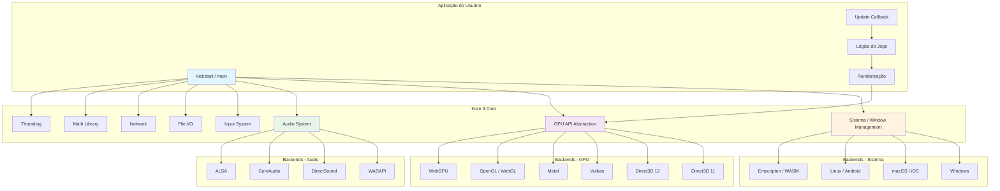
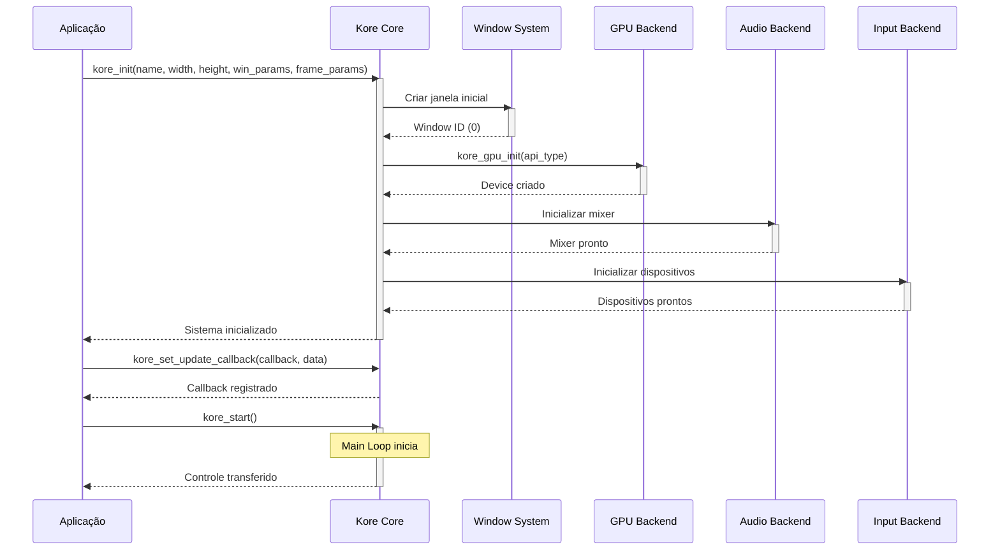
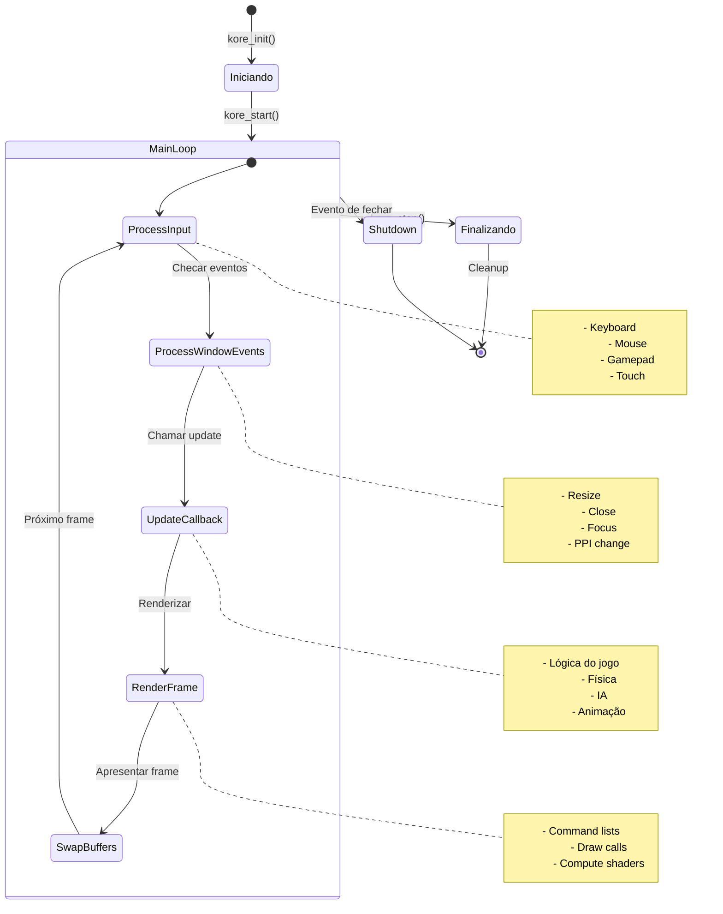
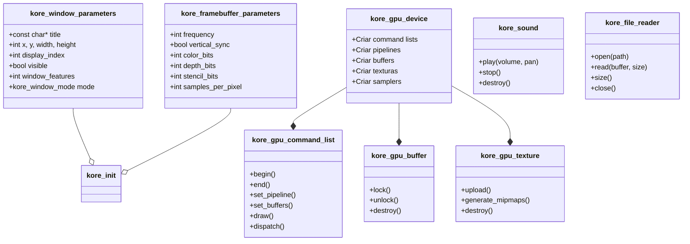
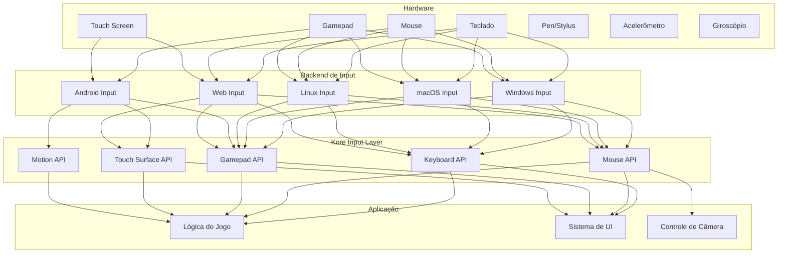
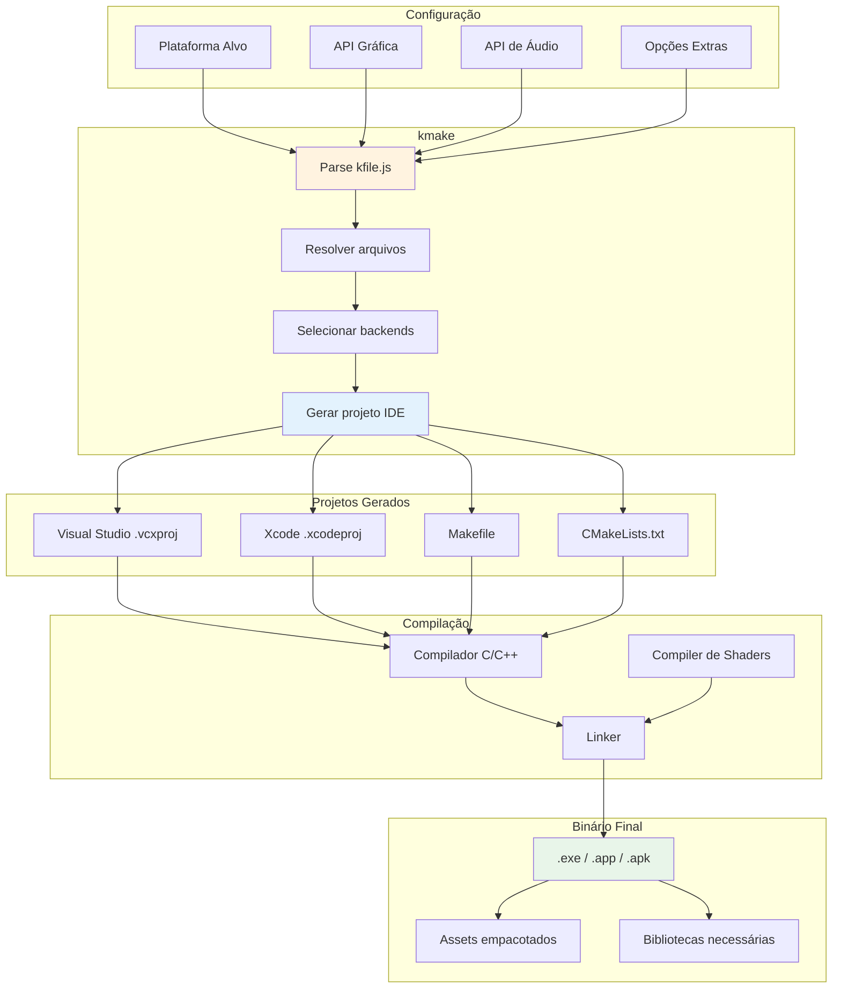
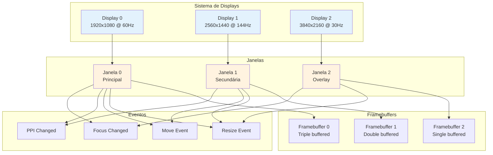
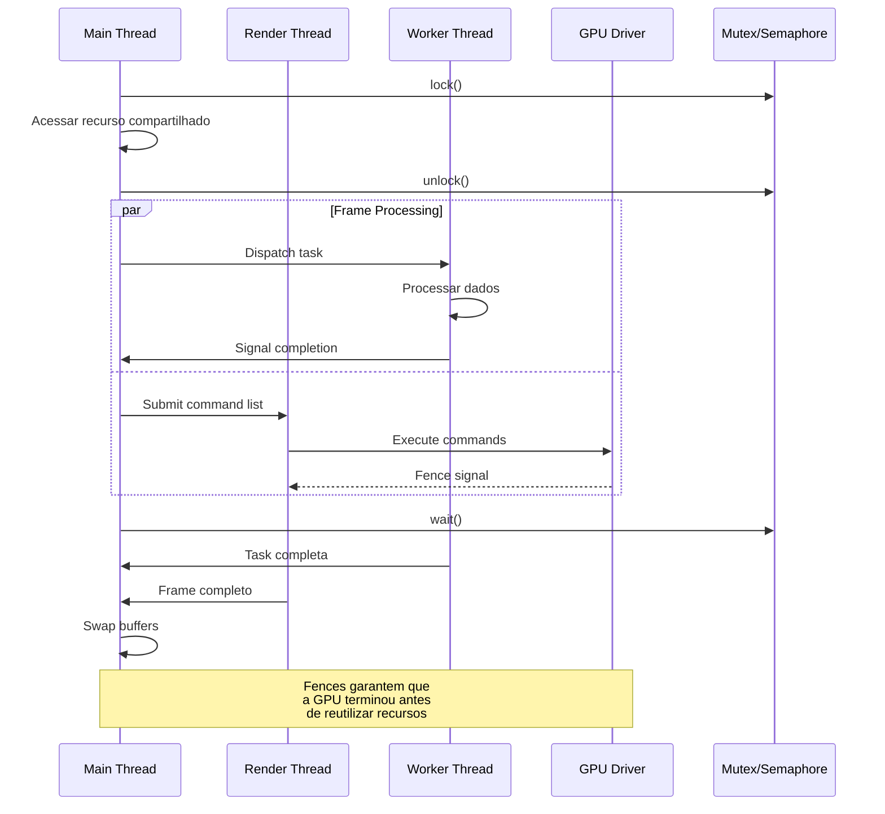

# Diagramas de Arquitetura do Kore 3

## Visão Geral da Arquitetura



---

## Fluxo de Inicialização



---

## Main Loop



---

## Pipeline de Renderização GPU

```mermaid
graph LR
    subgraph "Preparação"
        A[Criar Command List] --> B[Begin Command List]
        B --> C[Set Viewport]
        C --> D[Set Scissor]
        D --> E[Clear Render Target]
    end
    
    subgraph "Pipeline Setup"
        E --> F[Set Pipeline State]
        F --> G[Set Vertex Buffer]
        G --> H[Set Index Buffer]
        H --> I[Set Constant Buffers]
        I --> J[Set Textures]
        J --> K[Set Samplers]
    end
    
    subgraph "Draw/Dispatch"
        K --> L{Tipo?}
        L -->|Draw| M[Draw Indexed/Instanced]
        L -->|Dispatch| N[Dispatch Compute]
        L -->|Ray Trace| O[Dispatch Rays]
    end
    
    subgraph "Finalização"
        M --> P[End Command List]
        N --> P
        O --> P
        P --> Q[Submit to Queue]
        Q --> R[Signal Fence]
        R --> S[Present]
    end
    
    style A fill:#e3f2fd
    style F fill:#fff3e0
    style L fill:#f3e5f5
    style Q fill:#e8f5e9
```



---

## Hierarquia de Classes/Structs



---

## Sistema de Input



---

## Sistema de Áudio

```mermaid
graph TB
    subgraph "Fontes de Áudio"
        SoundFiles[Arquivos .wav/.ogg]
        Streams[Música/.ogg streams]
        Procedural[Áudio Procedural]
    end
    
    subgraph "Kore Audio System"
        Mixer[Mixer Principal]
        Voices[Canais/Voices]
        Effects[Efeitos (pan, volume)]
    end
    
    subgraph "Backends"
        WASAPI[WASAPI - Windows]
        DirectSound[DirectSound - Windows]
        CoreAudio[CoreAudio - macOS/iOS]
        ALSA[ALSA - Linux]
        OpenSL[OpenSL ES - Android]
        WebAudio[Web Audio API - Web]
    end
    
    subgraph "Output"
        Speakers[Alto-falantes]
        Headphones[Fones de ouvido]
        HDMI[Áudio HDMI]
    end
    
    SoundFiles --> Mixer
    Streams --> Mixer
    Procedural --> Mixer
    
    Mixer --> Voices
    Voices --> Effects
    
    Effects --> WASAPI
    Effects --> DirectSound
    Effects --> CoreAudio
    Effects --> ALSA
    Effects --> OpenSL
    Effects --> WebAudio
    
    WASAPI --> Speakers
    DirectSound --> Speakers
    CoreAudio --> Speakers
    ALSA --> Speakers
    OpenSL --> Speakers
    WebAudio --> Speakers
    
    WASAPI --> Headphones
    CoreAudio --> Headphones
    
    WASAPI --> HDMI
```

---

## Build System (kmake)



---

## Dependências entre Módulos

```mermaid
graph TD
    Global[global.h]
    System[system.h]
    Window[window.h]
    Display[display.h]
    Log[log.h]
    
    GPU[gpu/gpu.h]
    Device[gpu/device.h]
    CmdList[gpu/commandlist.h]
    Buffer[gpu/buffer.h]
    Texture[gpu/texture.h]
    Sampler[gpu/sampler.h]
    Pipeline[gpu/pipeline.h]
    RayTracing[gpu/raytracing.h]
    
    Audio[mixer/mixer.h]
    Sound[mixer/sound.h]
    SoundStream[mixer/soundstream.h]
    
    Keyboard[input/keyboard.h]
    Mouse[input/mouse.h]
    Gamepad[input/gamepad.h]
    Surface[input/surface.h]
    
    FileReader[io/filereader.h]
    FileWriter[io/filewriter.h]
    
    HTTP[network/http.h]
    Socket[network/socket.h]
    
    Vector[math/vector.h]
    Matrix[math/matrix.h]
    Quaternion[math/quaternion.h]
    Random[math/random.h]
    
    Thread[threads/thread.h]
    Mutex[threads/mutex.h]
    Semaphore[threads/semaphore.h]
    
    Image[image.h]
    Color[color.h]
    Video[video.h]
    
    VR[vr/vr.h]
    
    Global --> System
    Global --> Window
    Global --> Display
    Global --> Log
    Global --> GPU
    
    System --> Window
    System --> Display
    System --> Log
    
    GPU --> Device
    Device --> CmdList
    Device --> Buffer
    Device --> Texture
    Device --> Sampler
    Device --> Pipeline
    Pipeline --> RayTracing
    
    Audio --> Sound
    Audio --> SoundStream
    
    Image --> Color
    Video --> Image
    
    style Global fill:#ffcdd2
    style GPU fill:#bbdefb
    style Audio fill:#c8e6c9
    style Image fill:#fff9c4
```



---

## Ciclo de Vida de Recursos GPU

```mermaid
stateDiagram-v2
    [*] --> Alocado : create()
    
    state "Em Uso" como EmUso {
        Locked --> Mapped : lock()/map()
        Mapped --> Modificado : Escrever dados
        Modificado --> Unmapped : unlock()/unmap()
        Unmapped --> Ready : flush()
    }
    
    Alocado --> EmUso
    EmUso --> Ready
    
    Ready --> Bound : bind to pipeline
    Bound --> Drawing : draw/dispatch
    Drawing --> Ready : complete
    
    Ready --> Alocado : destroy()
    Bound --> Alocado : destroy()
    EmUso --> Alocado : destroy()
    
    note right of Alocado
        Memória alocada
        na GPU
    end note
    
    note right of Locked
        CPU espera GPU
        liberar recurso
    end note
    
    note right of Bound
        Recurso ativo
        no command buffer
    end note
    
    note right of Drawing
        GPU processando
        comandos
    end note
```

---

## Multi-Janela e Multi-Display



---

## Thread Safety e Sincronização


