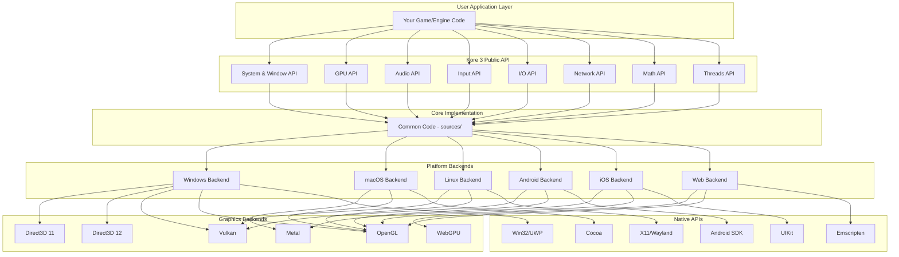
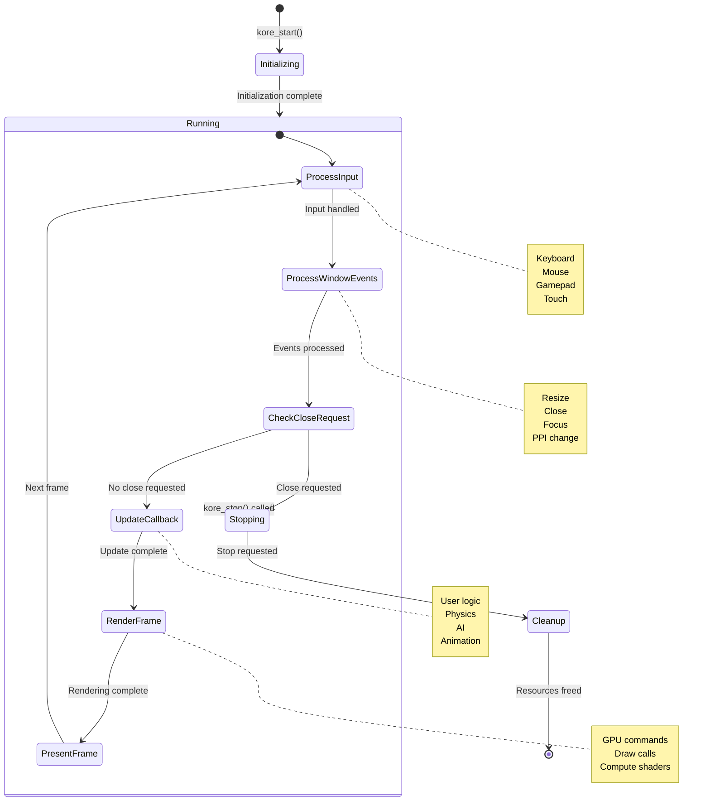
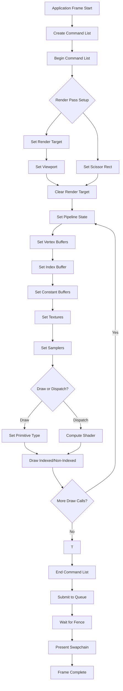
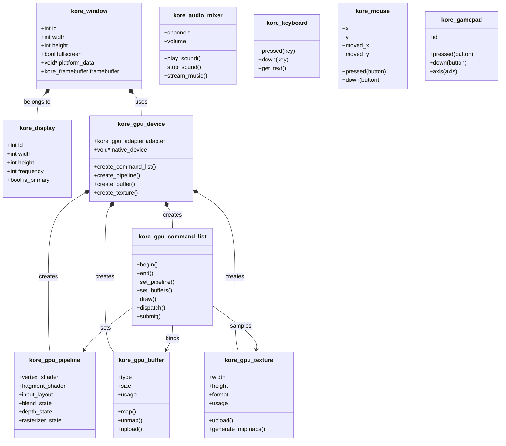
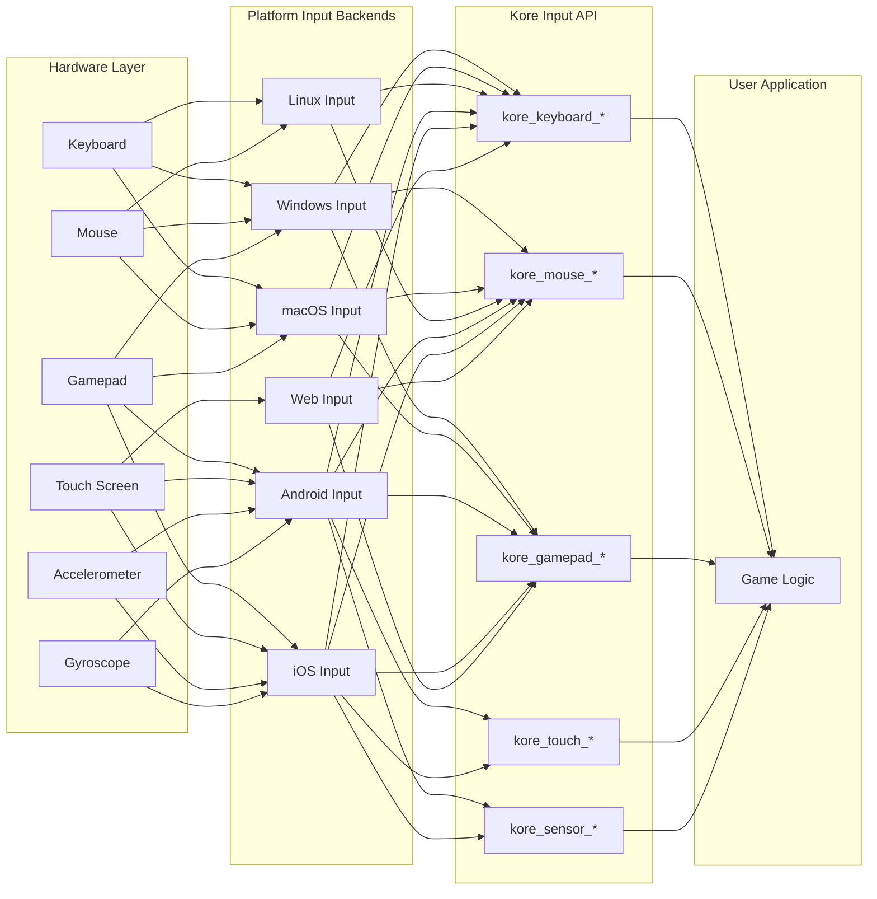
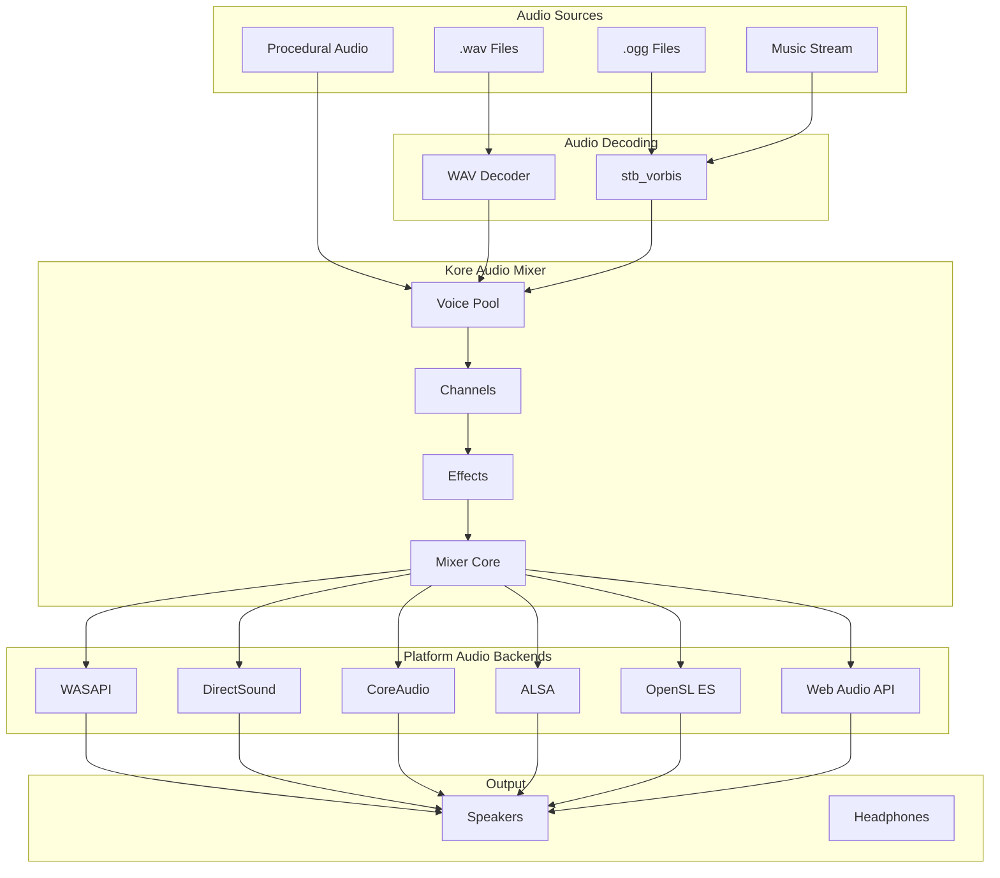
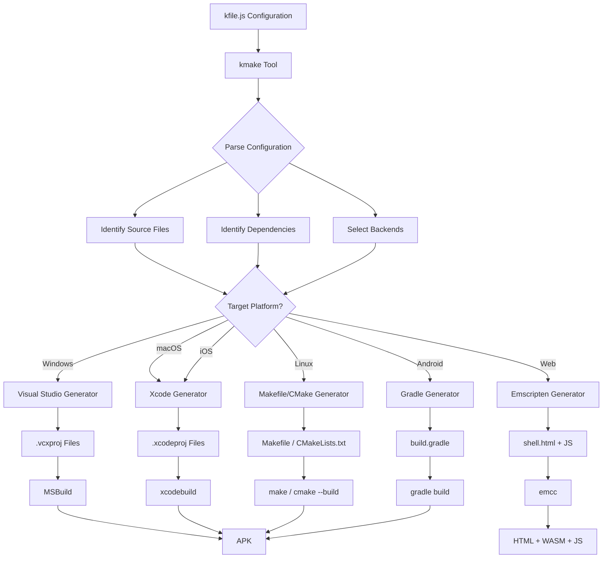
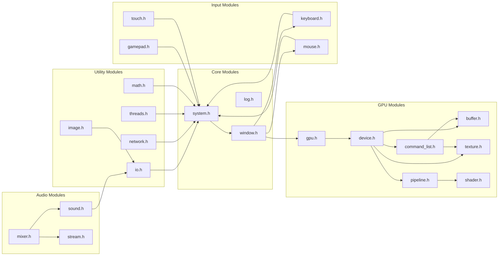
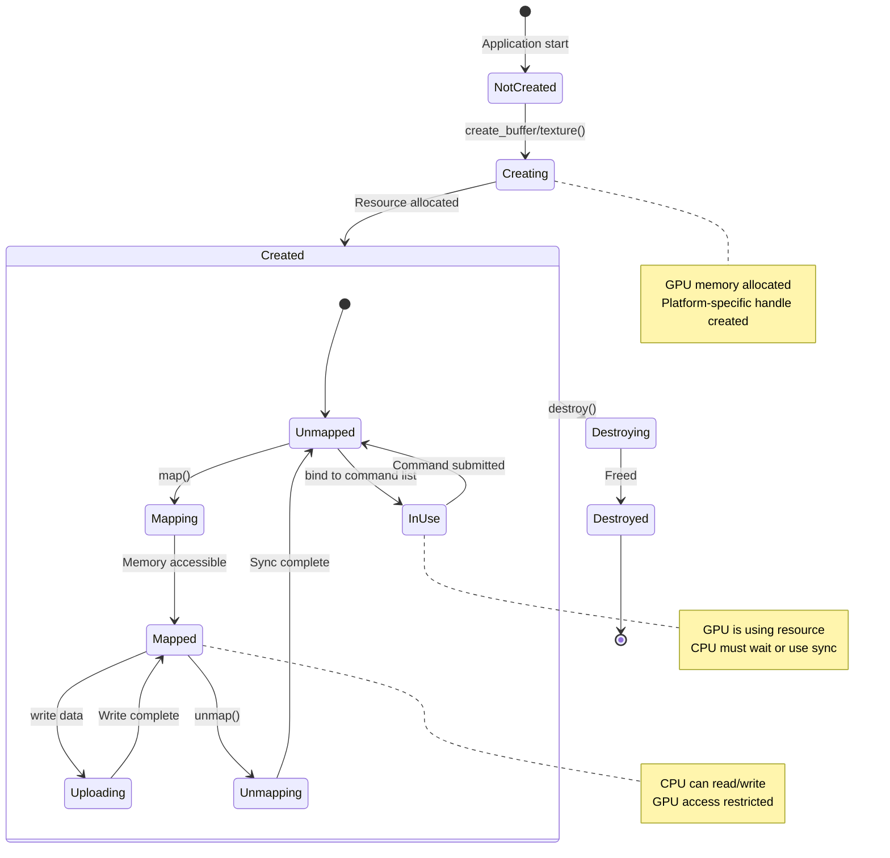
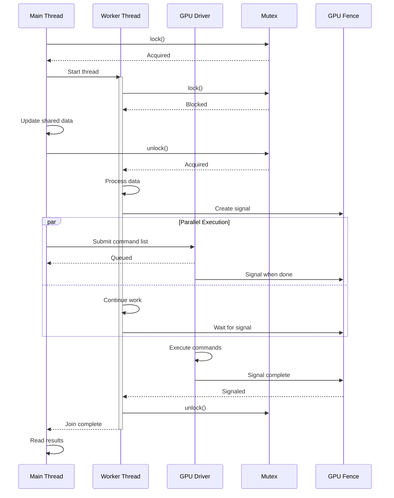

# Kore 3 - Mermaid Diagrams

## 1. General Architecture Overview



---

## 2. Initialization Flow

```mermaid
sequenceDiagram
    participant App as Application
    participant Kick as kickstart()
    participant Init as kore_init()
    participant GPU as kore_gpu_init()
    participant Callback as kore_set_update_callback()
    participant Start as kore_start()
    participant Loop as Main Loop
    participant Backend as Platform Backend
    
    App->>Kick: kickstart(argc, argv)
    activate Kick
    
    Kick->>Init: kore_init(title, width, height)
    activate Init
    Init->>Backend: Create window
    Backend-->>Init: Window handle
    Init-->>Kick: Success
    deactivate Init
    
    Kick->>GPU: kore_gpu_init(api_type)
    activate GPU
    GPU->>Backend: Initialize graphics context
    Backend-->>GPU: Device & swapchain
    GPU-->>Kick: GPU ready
    deactivate GPU
    
    Kick->>Callback: kore_set_update_callback(fn, data)
    activate Callback
    Callback-->>Kick: Callback registered
    deactivate Callback
    
    Kick->>Start: kore_start()
    activate Start
    Start->>Loop: Enter main loop
    activate Loop
    
    loop Every Frame
        Loop->>Backend: Process input events
        Backend-->>Loop: Input state
        
        Loop->>Backend: Process window events
        Backend-->>Loop: Window events
        
        Loop->>App: Call update callback
        App-->>Loop: Update complete
        
        Loop->>Loop: Render frame (GPU commands)
        Loop->>Backend: Present/Swap
        Backend-->>Loop: Frame displayed
    end
    
    Note over Loop: Continues until kore_stop()
    
    Loop-->>Start: Exit loop
    deactivate Loop
    Start-->>Kick: Return
    deactivate Start
    Kick-->>App: Return 0
    deactivate Kick
```

---

## 3. Main Loop State Diagram



---

## 4. GPU Rendering Pipeline



---

## 5. Class/Struct Hierarchy



---

## 6. Input System Architecture



---

## 7. Audio System Architecture



---

## 8. Build System (kmake) Flow



---

## 9. Module Dependencies Graph



---

## 10. GPU Resource Lifecycle



---

## 11. Multi-Window and Multi-Display Support

```mermaid
graph TB
    subgraph "Physical Displays"
        DISP1[Display 1<br/>1920x1080 @ 60Hz]
        DISP2[Display 2<br/>2560x1440 @ 144Hz]
    end
    
    subgraph "Kore Display Objects"
        KDISP1[kore_display #0<br/>Primary]
        KDISP2[kore_display #1<br/>Secondary]
    end
    
    subgraph "Kore Windows"
        WIN1[kore_window #1<br/>Main Game Window]
        WIN2[kore_window #2<br/>Editor Panel]
        WIN3[kore_window #3<br/>Debug Console]
    end
    
    subgraph "Framebuffers"
        FB1[Framebuffer 1<br/>Color + Depth]
        FB2[Framebuffer 2<br/>Color Only]
        FB3[Framebuffer 3<br/>Color + Depth]
    end
    
    DISP1 --> KDISP1
    DISP2 --> KDISP2
    
    KDISP1 --> WIN1
    KDISP1 --> WIN3
    KDISP2 --> WIN2
    
    WIN1 --> FB1
    WIN2 --> FB2
    WIN3 --> FB3
    
    FB1 --> GPU1[GPU Render Target 1]
    FB2 --> GPU2[GPU Render Target 2]
    FB3 --> GPU3[GPU Render Target 3]
    
    note right of WIN1
        Fullscreen possible
        Can span displays
    end note
    
    note right of WIN2
        Secondary display
        Different refresh rate
    end note
```

---

## 12. Thread Safety and Synchronization



